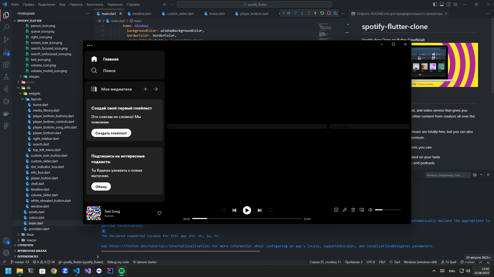
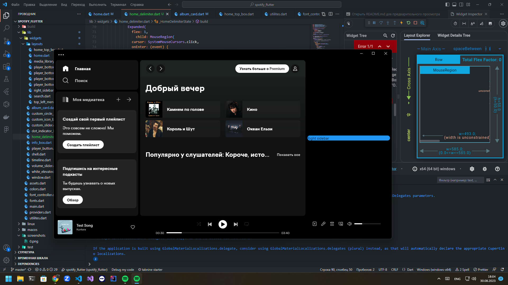
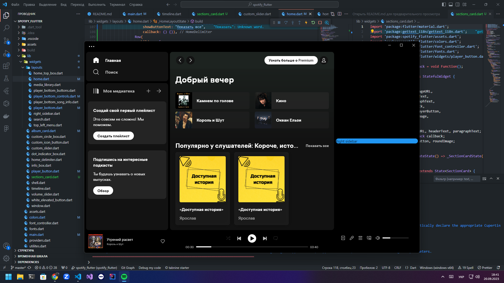

# spotify-flutter-clone


Spotify App Clone on flutter (Unofficial)


## What is Spotify?
Spotify is a digital music, podcast, and video service that gives you access to millions of songs and other content from creators all over the world.

Basic functions such as playing music are totally free, but you can also choose to upgrade to Spotify Premium.

Whether you have Premium or not, you can:

- Get recommendations based on your taste
- Build collections of music and podcasts
- And more!

## Start project
1. Get Flutter ```>=3.0.0 <4.0.0```
2. Run commands
    ```bash
    # Get all dependencies
    flutter pub get
    ```
3. Generate auth token, for connect to Spotify API. Token works one hour. Run [./generate_spotify_access_token.sh](./generate_spotify_access_token.sh).
4. After you have new file: ```spotify_access_token.json```. Open there and copy token to ```lib/layouts/home.dart```


[Official Spotify website](https://www.spotify.com/free/)

# History of the creation of the project
|№ |   SCREENSHOTS     |   DESCRIPTION |
|:-:|:-----------------:|:-------------:|
|1||  I have created a black box with three dots. For this I used bitsdojo_window. Also added the initial structure of the application, etc. |
|2|| Added player interface and localization, and again a lot of things. |
|3|| Added section card for home screen. |